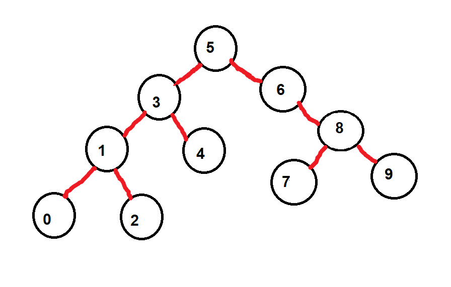
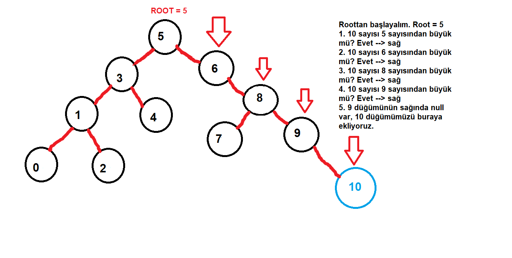
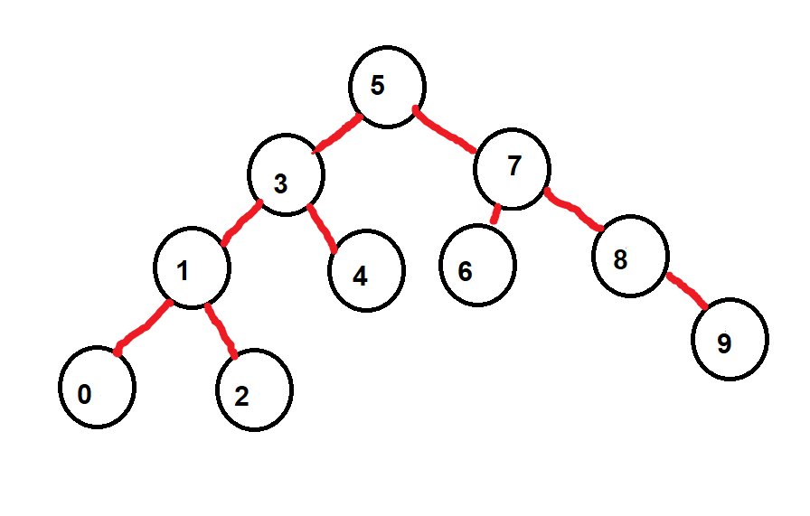
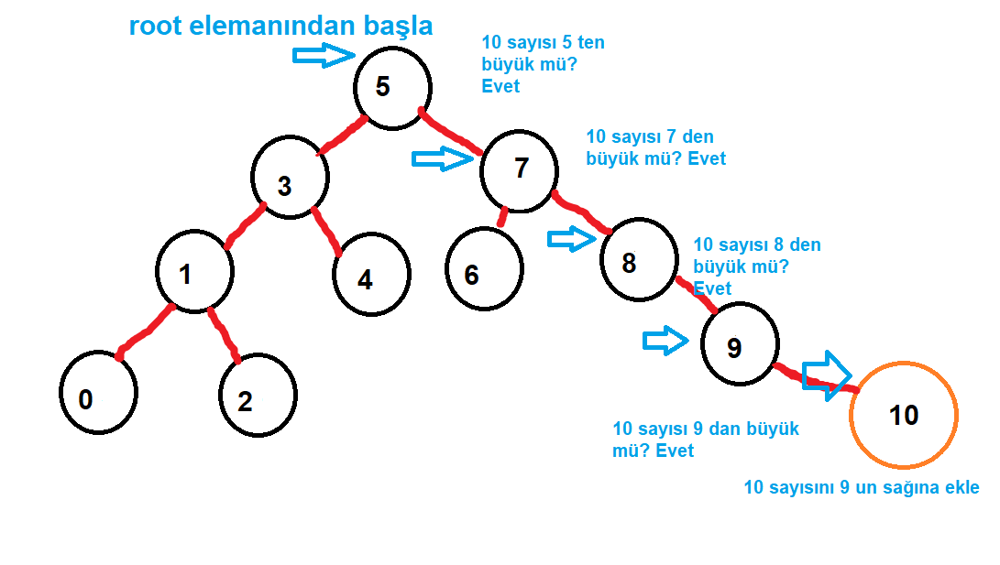

## Binary Search Tree --> [7, 5, 1, 8, 3, 6, 0, 9, 4, 2]

Sıralanmış dizi --> [0,1,2,3,4,5,6,7,8,9]

İlk önce root seçmemiz gerekiyor. Eğer daha hızlı bir binary search yapmak istiyorsak, root dizimizi sağda ve solda eşit sayıda node olacak şekilde bölmelidir.

Root olarak 5 sayısını seçtim.

## Aşamalar (kendi düşüncelerim)

1. diziyi roottan küçükler ve büyükler olarak ayır --> küçükler: [0,1,2,3,4], büyükler: [6,7,8,9]
2. dizinin en uç elamanından başlayarak ağacı çiz

Bizim dizimiz için şöyle olacaktır:

- en küçük elemanımız:0
- 0 elamından daha büyük olan en küçük sayıyı bağlayalım: 1 sayısını
- 1 sayısından daha büyük bir sayı var ise onu bir düğümünün sağına bağlayalım: 2 sayısı 1 den daha büyük ve 1 düğümünün sağına bağlandı.
- şimdi bir üst düğüme çıkmak için 2 sayısı dışındaki 1 den büyük en küçük sayıyı 1 düğümüne bağlayalım: 3 sayısı
- eğer 3 sayısından büyük bir sayı var ise onu 3 düğümüne bağlayalım: 4 sayısı
- bir üst düğüm için 3 ten büyük ve 4 olmayan en küçük sayıya bakalım
- dizimizde başka elaman kalmadığı için root kısmının sol tarafını birbirine bağlamış olduk.
- şimdi dizimizin sağ tarafı için en büyük elemanımızı bulalım: 9 sayısı
- bir üst düğüm için 9 sayısından küçük en büyük sayıyı bulalım: 8 sayısı
- eğer 8 sayısından daha küçük bir sayı var ise o sayıyı 8 düğümüne bağlayalım: 7 sayısı
- 7 sayısından küçük en büyük sayıyı bulup 7 düğümüne bağlayalım: 6 sayısı
- eğer 6 sayısından küçük bir sayı var ise o sayıyı 6 düğümüne bağlayalım: dizi elemanları bitti ve ağacımızı çizmiş olduk.

Eğer dizi olarak gösterecek olursak şöyle yapabiliriz. Her düğüm key, sol ve sağ pointerlarını içerir: [key,sol,sağ]

arr0 = [0,null,null]

arr2 = [2,null,null]

arr3 = [3,arr1,arr4] 

arr4 = [4,null,null]

arr1 = [1,arr0,arr2]

arr9 = [9,null,null]

arr7 = [7,null,null]

arr8 = [8,arr7,arr9]

arr6 = [6,null,arr8]

finally,

arr5 = [5,arr3,arr6]

## Binary tree ye bir sayı eklemek

Diyelim ki ağacımıza 10 sayısını eklemek istiyoruz

Roottan başlayarak düğümlere büyük mü küçük mü sorularını sorarak ilerliyoruz. Eğer bir noktada ilerlememiz gereken düğümde null değerini görürsek oraya düğümümüzü ekliyoruz.

---

Binary-tree konusu biraz karışık bir konu ve henüz tam tam olarak anlamış değilim. Buraları daha detaylı araştırıp bir binary tree oluşturmadan bu konunun tam olarak anlaşılmasının mümkün olmadığını düşünüyorum. 

Aşağıdaki görsellerde verilen dizinin bir başka ikili ağaç şekli mevcut. Yukardaki şekiller mi yoksa aşağıdakiler mi daha doğru bilemiyorum.

